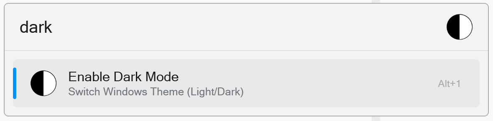
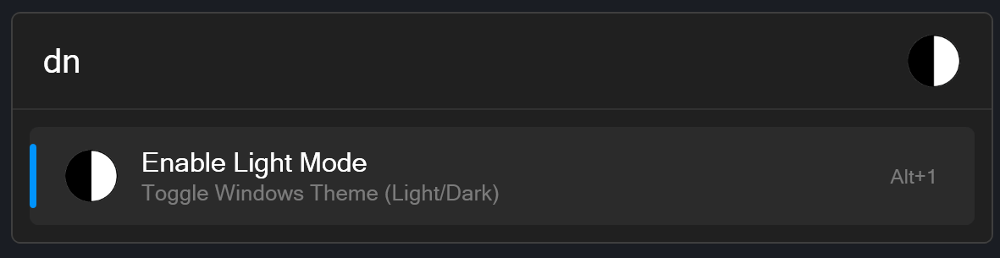

# DayNight Toggle

Flow Launcher plugin to toggle between light and dark mode in Windows 10/11.

Install this plugin via `pm install day-night-toggle`

## Usage

Type any of the following commands in Flow Launcher:

- `daynight`
- `dn`
- `day`
- `night`
- `light`
- `dark`
- `toggle`
- `theme`
- `th`
- `color`
- `colour`
