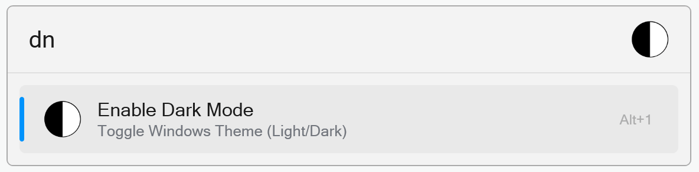

# DayNight Toggle

Flow Launcher plugin to toggle between light and dark mode in Windows 10/11.

- Install this plugin via `pm install DayNight Toggle` in Flow Launcher.
- Type `dn` in Flow Launcher to switch between Light and Dark mode.

